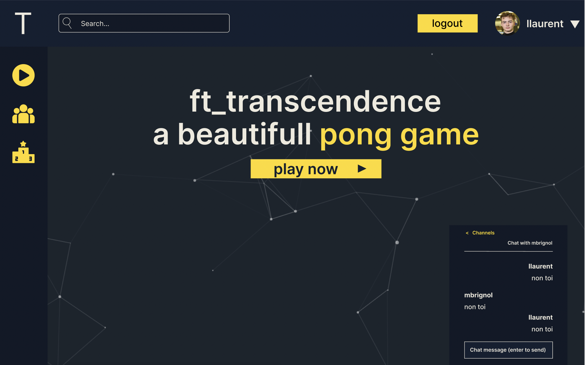

# Guide de démarrage

Ce guide vous permettra de setup le site web factilement en plusieurs étapes.

  

## Conventions

Nous utilisons pour ce projet NuxtJS en front et <EXPRESS?> en back.
Typescript est utilisé des deux côtés.
La base de données est en PostgreSQL.

## Organisation des dossiers

Le dossier front correspond au projet NuxtJS.  
Le dossier back correspond au projet <EXPRESS?>.  
Le dossier tmp (non présent pas défaut) est le dossier où les données postgre sont sauvegardées.

## Maquette

Les maquettes sont sur Figma, demander à `llaurent` pour avoir les accès.
 
## Les branches

Les branches `llaurent`, `timelecou`, `mbrignol` correspondent au branches des différentes personnes qui travaillent sur le projet.
La branche `master` est la branche à jour.

## Installer le projet

* Récupérer le projet en local

    `` git clone https://github.com/brokenfiles/ft_transcendence_ts ``

* Build et up les containers

    `` docker-compose up --build`` (ajoutez un -d pour se détacher des containers)

## Problèmes rencontrés

* Sur windows, si le dossier "nodes_modules" ne se crée pas, il faut installer les dépendances à la main via la commande `yarn install` dans le dossier `front`
 et `back`. Si le problème persiste, vérifiez que le partage de données via les volumes fonctionnent.
  
## Imcompatibilités

* Docker pour Windows sans Windows Pro ne fonctionne pas car les volumes ne sont pas partagés. Pour résoudre le problème, passez par une machine virtuelle.  
